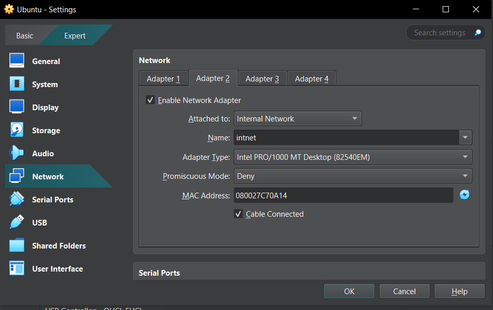
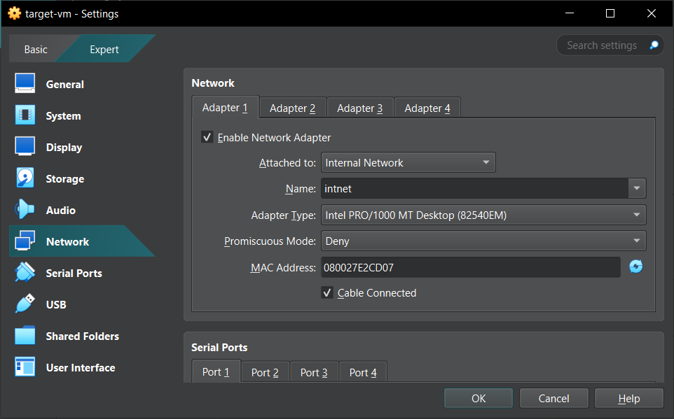
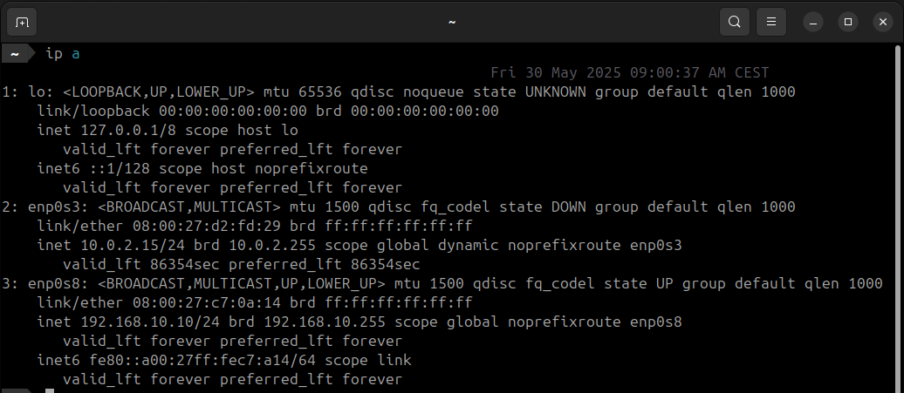
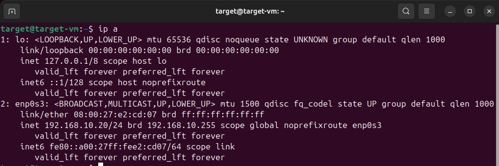
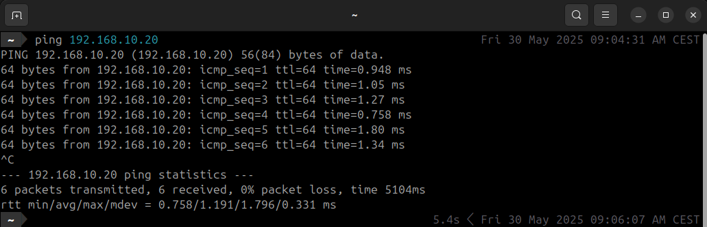
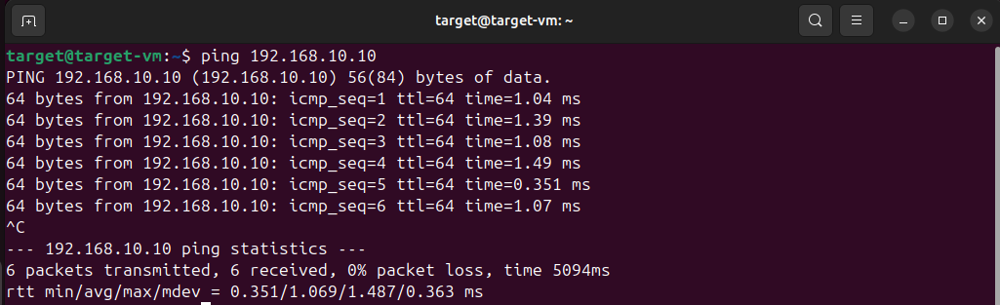
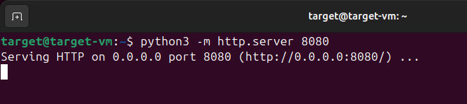
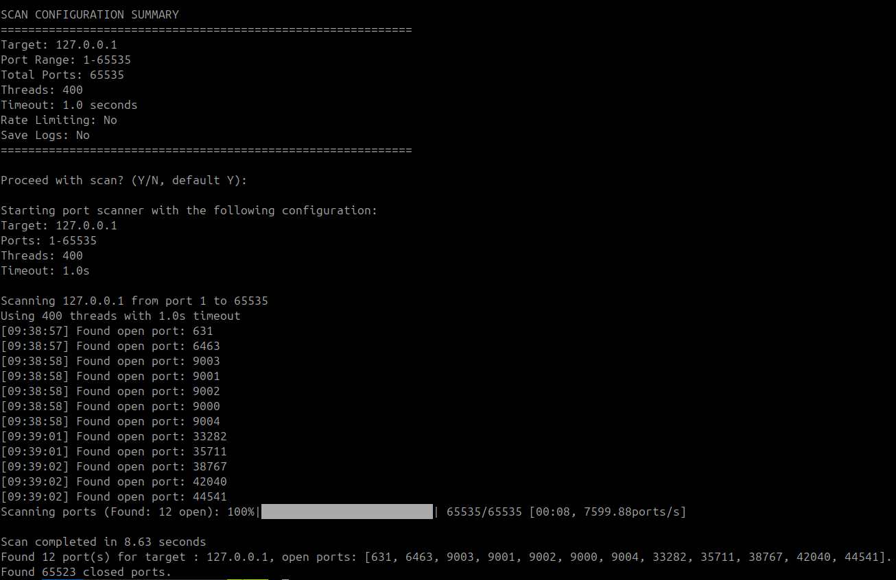
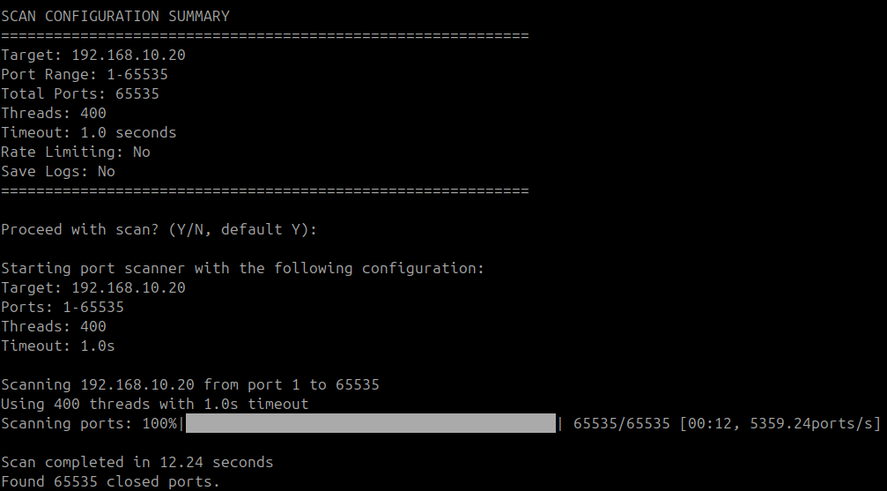
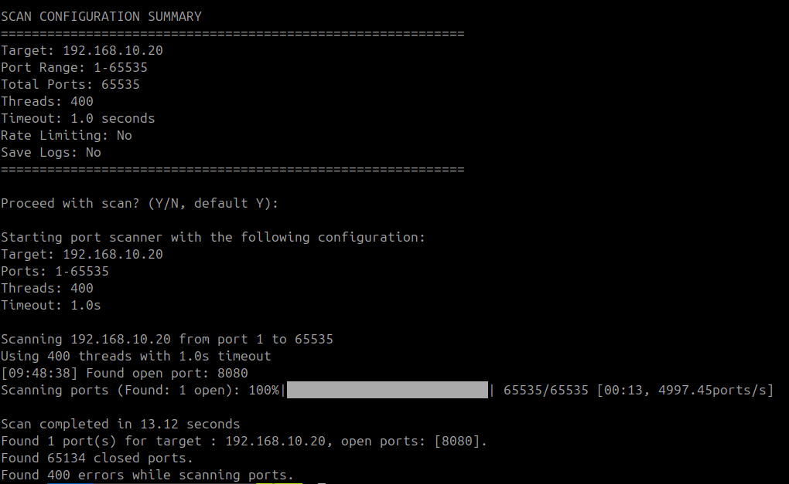

**<h1 style="text-align:center;">Port RADAR testing report</h1>**
**
Mihai, Jeremie, Bilal | Becode KAMKAR 2025
**

 

## Project Information
- **Project Name:** Port Radar  
- **Version:** 1.0  
- **Test Date:** 30/05/2025 
- **Tested By:** Jeremie Loriaux 
- **Coach/Supervisor:** Mathias / Sananda

---

## Objective
The objective of this testing is to validate the functionality, stability and accuracy of the Port Radar program. The program is expected to identify open TCP ports of a chosen ip address or domain name with either a normal tcp scan or a syn scan for better stealth.

---

## Test Environment

| Component         | Details                          |
|-------------------|---------------------------------|
| Machines          | Ubuntu(VM1), target-vm(VM2) |
| Operating System  | Ubuntu 24.04.2 LTS, Ubuntu 22.04 LTS |
| Python Version    | 3.12.3                    |
| Network Setup     | Local Network named intnet  |

---

## Environement setup
1. Setup both VM's on the same internal network>\
| VM1: Internal Adapter, Intnet | VM2: Internal Adapter, Intnet |\
 

2. Assigned the VM's ip addresses on the same subnet (/24).\
| -----VM1: 192.168.10.10 -----|----- VM2: 192.168.10.20 -----|\
 

3. Pinged each other to check if the can reach each other.\
| -----VM1: Ping successfull -----|----- VM2:Ping successfull -----|\
 

4. Open port 8080 with the command python -m http.server 8080 on VM2.\

## Test Cases

| Test Case ID | Description                       | Input                       | Expected Result                              | Actual Result     | Pass/Fail |
|--------------|----------------------------------|-----------------------------|----------------------------------------------|-------------------|-----------|
| TC01         | Scan open TCP ports on localhost | 127.0.0.1, rest default              | List of open ports on local machine         | [631, 6463, 9003, 9001, 9002, 900, ...]      | Pass        |
| TC02         | Scan open TCP ports on VM2      | 192.168.10.20, rest default | List of open ports on target machine             | None          | Fail        |
| TC03         | Scan open TCP ports on VM2 after opening port 8080 | 192.192.168.10.20, rest default | [8080] | [8080] | pass        |

---

## Bugs / Issues Found

No bugs were detected.

---

## Summary

- **Total Test Cases:** 3
- **Passed:** 2 
- **Failed:** 1    

**Conclusion:**  
The scanner performs as expected in identifying open ports.

---

## Attachments
### Test screenshots :
 #### Test Case 1:
 

  ### Test Case 2:
 

  ### Test Case 3:
 